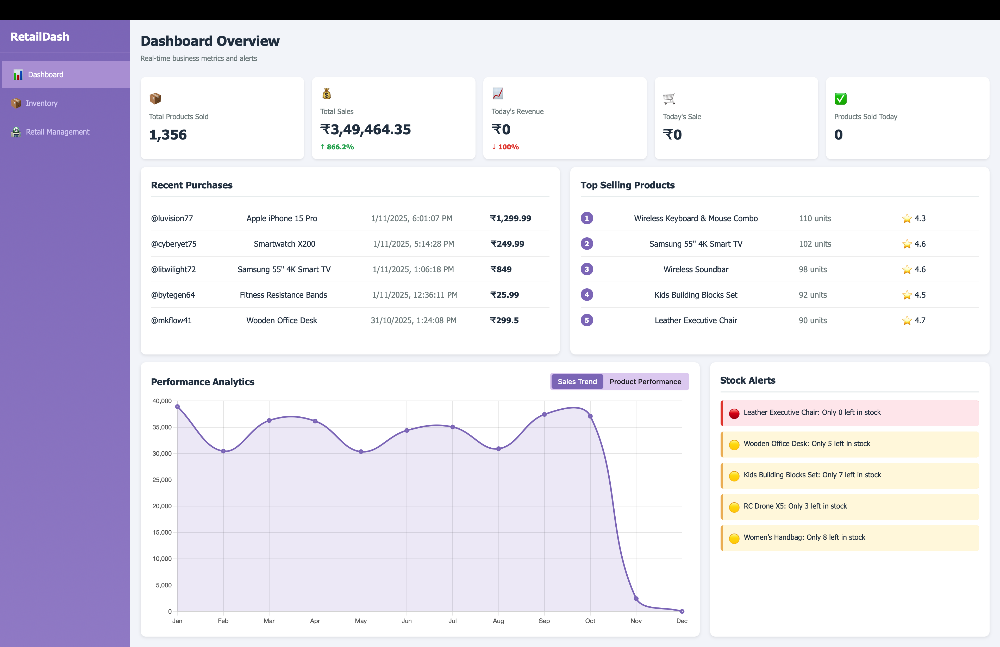
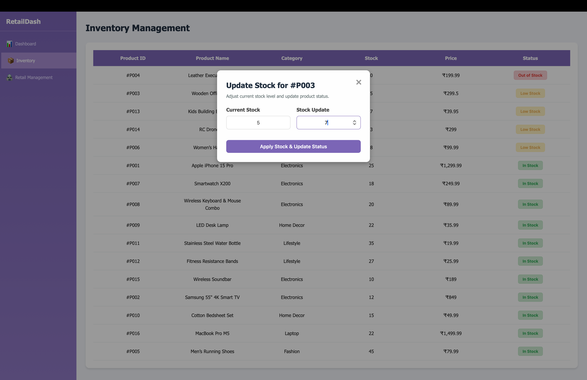
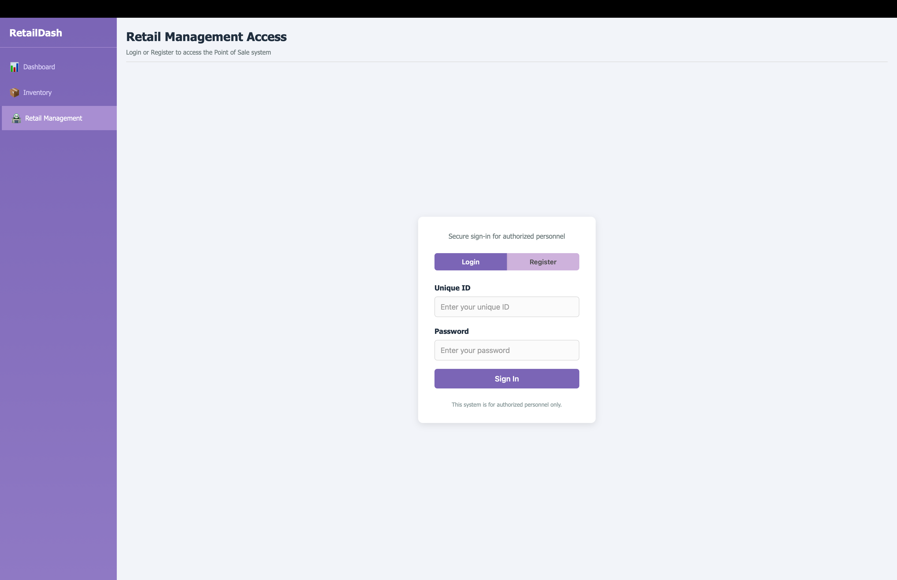
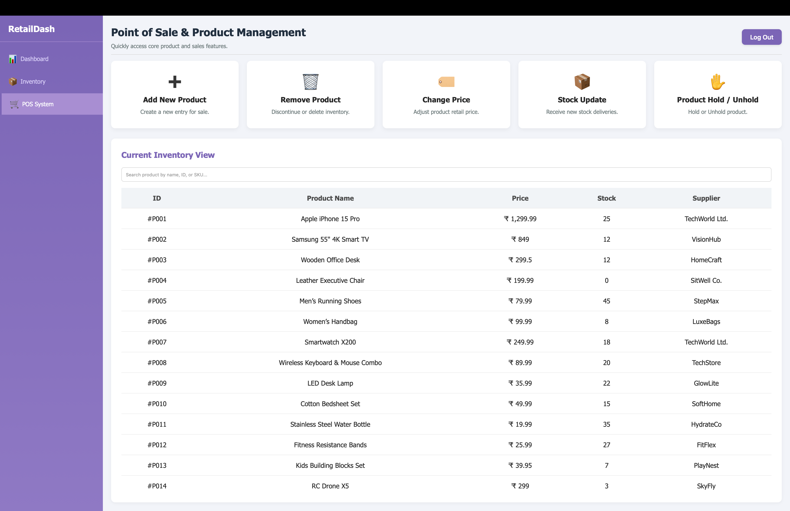

# Inventory Sales Management System

A full-stack retail inventory and sales management application with a FastAPI backend, PostgreSQL database, and static HTML/CSS/JavaScript frontend. The FastAPI server serves both the frontend and backend API from one local port.

The project includes dashboard analytics, inventory tracking, admin registration/login, product management, stock updates, and product pricing workflows.

## Features

- Dashboard with sales metrics, recent purchases, top products, charts, and stock alerts
- Inventory page with sorted stock status and stock adjustment workflow
- Retail management login and registration flow
- POS/product management screens for add, delete, price update, and stock update workflows
- PostgreSQL-backed data models using SQLAlchemy async sessions
- SendGrid integration for admin ID email delivery during registration
- Single-server local run: frontend pages and `/api` endpoints are served by FastAPI

## Tech Stack

- Backend: FastAPI, SQLAlchemy, asyncpg, Pydantic
- Database: PostgreSQL
- Authentication utilities: Passlib password hashing
- Email: SendGrid
- Frontend: HTML, CSS, JavaScript, Chart.js

## Screenshots

### Dashboard



### Inventory



### Retail Management



### POS System



## Project Structure

```text
.
├── backend/
│   └── app/
│       ├── main.py              # FastAPI app entry point and frontend static mount
│       ├── database.py          # Database engine and session setup
│       ├── models/              # SQLAlchemy models
│       └── routes/              # API routes
├── frontend/
│   ├── dashboard/               # Dashboard UI
│   ├── inventory/               # Inventory UI
│   └── retail-management/       # Login and POS/product management UI
├── assets/
│   └── screenshots/             # README screenshots
├── requirements.txt
├── .env.example
├── .gitignore
├── LICENSE
└── README.md
```

## Getting Started

### Prerequisites

- Python 3.11+
- PostgreSQL
- A SendGrid API key, if email delivery is required

### Setup

Create and activate a virtual environment:

```bash
python -m venv .venv
source .venv/bin/activate
```

Install dependencies:

```bash
pip install -r requirements.txt
```

Create your local environment file:

```bash
cp .env.example backend/.env
```

Update `backend/.env` with your local values:

```env
DB_HOST=localhost
DB_PORT=5432
DB_USER=postgres
DB_PASSWORD=your-password
DB_NAME=retaildash
SENDGRID_API_KEY=your-sendgrid-api-key
FROM_EMAIL=no-reply@example.com
SQL_ECHO=false
```

Start the application:

```bash
uvicorn backend.app.main:app --reload
```

Open the app:

```text
http://127.0.0.1:8000
```

The frontend uses relative `/api` requests, so the browser UI and backend endpoints run on the same origin.

## API Overview

All API routes are prefixed with `/api`.

Common endpoints include:

- `GET /api/dashboard`
- `GET /api/product_info`
- `GET /api/pos_products`
- `POST /api/register_admin`
- `POST /api/login_admin`
- `POST /api/add_product`
- `PUT /api/update_stock/{product_id}`
- `PUT /api/update_price/{product_id}`
- `DELETE /api/remove_product/{product_id}`

## Environment Variables

Use `.env.example` as the template for `backend/.env`.

Do not commit real credentials or local environment files.

## Current Status

This project is organized for GitHub upload and local development as a demo project.

Future improvements:

- Restrict CORS origins before deployment
- Add automated tests
- Replace automatic schema creation with migrations for production use

## License

This project is licensed under the MIT License. See `LICENSE` for details.
